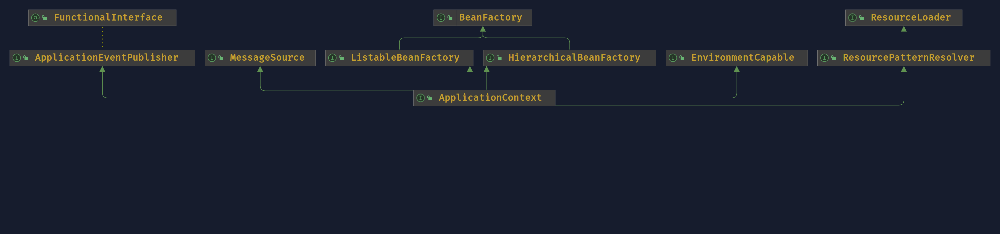

# Spring IoC 容器

## 介绍
Spring 使用依赖注入（Dependency injection ）来实现控制反转（ Inversion of Control ）原则。
对象可以通过以下方式定义其依赖项：
- 构造方法的参数
- 工厂方法的参数
- 对象实例的属性
  
IoC 容器在创建 Bean 时，注入这些依赖项。通过类的原始构造方法或一些机制（如服务定位器模式）控制 bean 本身依赖的位置和实例化，这个过程从根本上来说是 bean 本身的逆过程（因此得名“控制反转”）

```{note}
参考 [Inversion of Control vs Dependency Injection](https://stackoverflow.com/questions/6550700/inversion-of-control-vs-dependency-injection)

 **控制反转是什么，反转了什么？**<br>
 控制反转就是将顺序编写的代码转变为委托结构，反转的是程序控制流，不是由程序员控制程序的流程，而是由外部源（框架、服务、其他组件）控制程序的流程。
 控制反转是框架与库不同的关键部分。库本质上是一组可以调用的函数或类，每个调用都会执行一些工作并将控制权返回给客户端。
 
 **依赖注入是什么，与控制反转有什么关系？**<br>
 Dependency-Injection (DI) 是 IoC 更具体版本，依赖注入本质上就是提供对象所需的对象（其依赖项），而不是让它自己构造它们。
```

## 容器
`org.springframework.beans` 和 `org.springframework.context` 包是 Spring Framework 的 IoC 容器的基础。BeanFactory 提供了配置框架和基本功能， ApplicationContext 添加了更多企业特定的功能。



`org.springframework.context.ApplicationContext` 接口代表 Spring IoC 容器，负责实例化、配置和组装 bean。容器通过读取配置元数据来获取要实例化、配置和组装哪些对象的指令。配置元数据以 XML、Java 注释或 Java 代码表示。


```{caution}
ApplicationContext 提供了 getBean 方法来获取 bean 实例，但是官网并不建议在应用程序代码调用 getBean() 方法，而是使用依赖注入来获取所依赖的 bean 实例。
```

## Bean
由 Spring IoC 容器实例化、组装和管理的对象，就成为 Spring bean。在容器本身内，这些 bean 定义表示为 BeanDefinition 对象。bean 的定义本质上是创建一个或多个对象的配方，可以通过以下方式实例化 bean
- 构造方法
- 静态工厂方法
- 实例工程方法

## 依赖
DI 存在两种主要方式：
- 基于构造函数的依赖注入
- 基于 Setter 的依赖注入

```{note}
**循环依赖**
若A、B相互依赖，则可以基于 Setter 进行依赖注入，Spring 会强制其中一个 Bean 在完全初始化之前注入另一个 Bean。
```

## 自动注入

| 模式           | 解释                                                                                                                                                            |
|---------------|---------------------------------------------------------------------------------------------------------------------------------------------------------------|
| `no`          | （默认）没有自动注入。Bean引用必须由 `ref` 元素来定义。对于大型部署来说，不建议改变默认设置，因为明确指定协作者会带来更大的控制力和清晰度。在某种程度上，它记录了一个系统的结构。                                                                |
| `byName`      | 通过属性名称进行自动注入。Spring寻找一个与需要自动注入的属性同名的Bean。例如，如果一个Bean定义被设置为按名称自动注入，并且它包含一个 `master` 属性（也就是说，它有一个 `setMaster(..)` 方法），Spring会寻找一个名为 `master` 的Bean定义并使用它来设置该属性。 |
| `byType`      | 如果容器中正好有一个 property 类型的 bean 存在，就可以自动注入该属性。如果存在一个以上的bean，就会抛出一个致命的 exception，这表明你不能对该bean使用 `byType` 自动注入。如果没有匹配的 bean，就不会发生任何事情（该属性没有被设置）。                   |
| `constructor` | 类似于 `byType`，但适用于构造函数参数。如果容器中没有一个构造函数参数类型的bean，就会产生一个致命的错误。|

```{tip}
通过 byType 或 constructor 自动注入模式，可以将数组（array）和泛型集合（collection）注入。
```

```java
// byType
List<LogicHandler> list;

// constructor
public class BeanConstructor {
    public BeanConstructor(List<LogicHandler> handler) {
        this.handler = handler;
    }
}
```

## Bean Scope

- singleton
- prototype
- request
- session
- application
- websocket

```{note}
spring 提供了 thread scope（`SimpleThreadScope`）, 但默认没有注册，如需要使用，可通过 `ConfigurableBeanFactory`接口上声明的`void registerScope(String scopeName, Scope scope);` 注册。需要自定义其他 scope ，先实现 `Scope` 接口，再`registerScope` 注册，就可以通过`@Scope("customScope")`使用了。
```

## 自定义 Bean 的生命周期

- `@PostConstruct` 和 `@PreDestroy` 注解。**推荐使用**。
- `InitializingBean` 和 `DisposableBean` callback 接口。
- 自定义 `init()` and `destroy()` 方法。

为同一个Bean配置的多个生命周期机制，具有不同的初始化方法，其调用方式如下。

1. 注解了 `@PostConstruct` 的方法。
2. `afterPropertiesSet()`，如 `InitializingBean` 回调接口所定义。
3. 一个自定义配置的 `init()` 方法。

销毁方法的调用顺序是一样的。
1. 注解了 `@PreDestroy` 的方法。
2. `destroy()`，正如 `DisposableBean` 回调接口所定义的那样。
3. 一个自定义配置的 `destroy()` 方法。

## 启动关闭回调

`Lifecycle` 接口定义（可以用来启动和停止一些后台进程）。
```java
public interface Lifecycle {

    void start();

    void stop();

    boolean isRunning();
}
```
如果启动和关闭调用的顺序可能很重要，可以考虑使用 `SmartLifecycle`，启动时，phase最低的对象先启动。当停止时，遵循相反的顺序。

```java
public interface Phased {

    int getPhase();
}

public interface SmartLifecycle extends Lifecycle, Phased {

    boolean isAutoStartup();

    void stop(Runnable callback);
}
```

## Aware 接口

| 接口名称  | 注入的依赖性        | 解释      |
| ------- | ------------------ | ------   |
| `ApplicationContextAware`        | 声明 `ApplicationContext`。    | [`ApplicationContextAware` 和 `BeanNameAware`](https://springdoc.cn/spring/core.html#beans-factory-aware) |
| `ApplicationEventPublisherAware` | 封装了 `ApplicationContext` 的 Event publisher 。| [`ApplicationContext` 的附加功能](https://springdoc.cn/spring/core.html#context-introduction)|
| `BeanClassLoaderAware`           | 用来加载Bean类的类加载器（Class loader）。 | [实例化 Bean](https://springdoc.cn/spring/core.html#beans-factory-class)|
| `BeanFactoryAware`               | 声明 `BeanFactory`。   | [`BeanFactory` API](https://springdoc.cn/spring/core.html#beans-beanfactory) |
| `BeanNameAware`                  | 声明Bean的名称。  | [`ApplicationContextAware` 和 `BeanNameAware`](https://springdoc.cn/spring/core.html#beans-factory-aware) |
| `LoadTimeWeaverAware`            | 定义了用于在加载时处理类定义的织入点。 | [在Spring框架中用AspectJ进行加载时织入（Load-time Weaving）](https://springdoc.cn/spring/core.html#aop-aj-ltw)|
| `MessageSourceAware`             | 配置解析消息的策略（支持参数化和国际化）。  | [`ApplicationContext` 的附加功能](https://springdoc.cn/spring/core.html#context-introduction) |
| `NotificationPublisherAware`     | Spring JMX notification publisher。| [Notifications](https://springdoc.cn/spring/integration.html#jmx-notifications)|
| `ResourceLoaderAware`            | 配置的加载器用于低级别的资源访问。  | [资源（Resources）](https://springdoc.cn/spring/core.html#resources)|
| `ServletConfigAware`             | 容器所运行的当前 `ServletConfig`。仅在 Web 感知的 Spring `ApplicationContext` 中有效。 | [Spring MVC](https://springdoc.cn/spring/web.html#mvc)|

## 容器扩展点