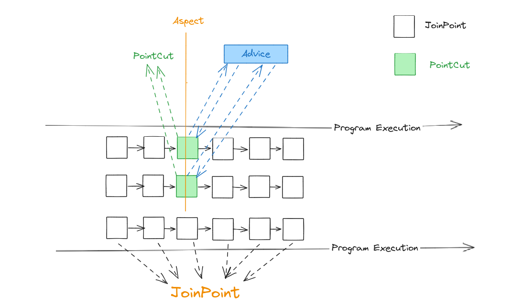

# AOP编程

## 术语
- **切面（Aspect）**： 一个模块化的关注点，一般跨越多个类。如事务管理。
- **连接点（Join point）**：程序执行过程中的一个点。例如一个方法的执行或一个异常的处理。Spring 中的连接点是一个方法的执行。
- **通知（Advice）**：在切面的一个连接点所执行的操作。通知类型包括："around", "before", "after"
- **切点（Pointcut）**：需要执行通知的连接点，也就是匹配**切点表达式**的连接点。比如去餐馆吃饭，连接点就是菜单上的菜品，切点就是自己点的菜。
- **Introduction**：声明附加方法或字段来代表一个类型，可以看作一种特殊的通知。（**我不理解**）
- **Target object**:
- **AOP proxy**
- **Weaving**

主要概念之间关系如下图所示

Advice type:
- Before advice
- After returning advice:
- After throwing advice
- After (finally) advice
- Around advice